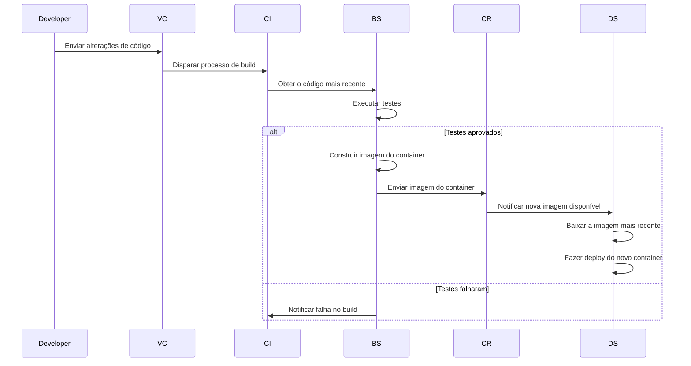

## Summary

## Introduction

:::alert{type="note"}
Esse post faz parte da minha jornada de aprendizado em **DevOps**! Se algo parecer incorreto ou confuso, fique à vontade para deixar um [comentário](#comments) ou se conectar comigo no :mention[Linkedin (LucJosin)]{url="https://www.linkedin.com/in/LucJosin"} ou :mention[GitHub (LucJosin)]{url="https://github.com/LucJosin"}.
:::

Enquanto estudamos **DevOps** e aplicações em containers, uma das primeiras coisas que aprendemos é: _Como criar um pipeline de deploy para que seus containers/imagens sejam **construídos**, **etiquetados** e **enviados** automaticamente_.

Neste post, vou mostrar como configurei um workflow de **CI/CD** usando o **GitHub Actions** para publicar containers/imagens no **GitHub Container Registry (GHCR)**.

### O que é CI/CD?

O **CI/CD** significa `Integração Contínua` e `Entrega (ou Deploy) Contínua`.

- **CI**: Automatiza o processo de testar e construir o código sempre que você envia alterações.
- **CD**: Automatiza o deploy, colocando seu código em um ambiente _(ex: produção/desenvolvimento)_.

Usando ambos, você garante que cada mudança seja **integrada**, **testada**, **construída** e **entregue** rapidamente.

### O que é o GHCR (GitHub Container Registry)?

O **GHCR** é o registro de containers nativo do GitHub, semelhante ao :mention[Docker Hub]{url="https://hub.docker.com"}, porém mais integrado ao **GitHub**. Ele permite que você:

1. Armazene e gerencie containers/imagens
2. Associe imagens diretamente aos repositórios
3. Controle o acesso via permissões do GitHub

É gratuito para repositórios públicos e também suporta hospedagem privada de imagens. Além disso, funciona perfeitamente com o **GitHub Actions**.

### Fluxo do CI/CD

Aqui está um fluxo visual para o **CI/CD**:



## Visão geral do aplicativo

Para este post, criei um simples webapp em **Golang**. Você pode encontrar o código no repositório do GitHub:

https://github.com/LucJosin/labs/tree/main/blog/actions-containers-ghcr

## Configurando o Dockerfile

Antes de configurar nosso workflow do **GitHub Actions**, vamos definir o **Dockerfile**, que descreve como _construir_ e _executar_ nosso aplicativo **Go** dentro de um **contêiner**.

Aqui está o **Dockerfile** completo:

```dockerfile
# ---- Etapa de Build ----
FROM golang:1.22-alpine AS builder

# Definir diretório de trabalho
WORKDIR /app

# Instalar pacotes necessários
RUN apk add --no-cache git

# Copiar o arquivo go.mod
COPY go.mod ./

# Baixar dependências
RUN go mod download

# Copiar o restante do código-fonte
COPY . .

# Compilar a aplicação Go
RUN GOOS=linux go build -o app main.go

# ---- Etapa de Execução ----
FROM alpine:latest

# Definir diretório de trabalho
WORKDIR /app

# Copiar o binário e os arquivos de template da etapa de build
COPY --from=builder /app/app /app/index.tmpl ./

# Expor porta
EXPOSE 8080

# Executar a aplicação
CMD ["./app"]
```

Neste caso, usamos um **Dockerfile** de múltiplas etapas:

1. **Build**:

   - Configura o ambiente **Go** utilizando uma imagem _(com Golang configurado)_.
   - Instala pacotes necessários _(como o **Git**, usado para buscar dependências do **Go**)_.
   - Copia o código-fonte e os arquivos de módulos.
   - Baixa as dependências com `go mod download`.
   - Compila a aplicação em um binário usando `go build`.

2. **Run**:

   - Utiliza uma imagem (base) **leve** para manter a imagem final pequena.
   - Copia o binário compilado da **fase de build**.
   - Define o **diretório de trabalho**.
   - Expondo a **porta** que o app usará.
   - Define o **comando** para rodar o app.

## Configurando o GitHub Actions

Agora que definimos as instruções para construir a imagem, vamos configurar nosso workflow com o arquivo **build.yml**, este arquivo diz ao **GitHub Actions** _como_ e _quando_ executar ações/passos/tarefas automatizadas.

O GitHub permite que você tenha múltiplos `workflows`, todas as configurações **.yaml** devem estar no diretório `.github/workflows/`.

Aqui está o arquivo completo de workflow:

```yaml title=".github/workflows/build.yml"
# Nome do workflow exibido no GitHub Actions
name: 'Build e Push para GHCR'

# Aciona o workflow quando um tag é enviado, como: v1.0.0
on:
  push:
    tags:
      - 'v[0-9].[0-9]+.[0-9]'

# Define variáveis de ambiente disponíveis para todos os passos
env:
  GHCR_TOKEN: ${{ secrets.GHCR_TOKEN }} # Token do GitHub Container Registry (definido nos segredos do repositório)
  CONTAINER_NAME: lucjosin/go-webapp-ghcr # Nome da imagem a ser publicada (tudo minúsculo)
  USER_NAME: LucJosin # Nome de usuário do GitHub usado para autenticação no GHCR

jobs:
  build-and-push:
    runs-on: ubuntu-latest # Usa o runner mais recente do Ubuntu

    steps:
      # Passo 1
      - name: Configurar checkout
        uses: actions/checkout@v4

      # Passo 2
      - name: Configurar a tag git mais recente
        run: |
          RAW_TAG="${GITHUB_REF#refs/tags/}"
          VERSION="${RAW_TAG#*@}"
          echo "VERSION=${VERSION}" >> $GITHUB_ENV
          echo "Versão: $VERSION"

      # --- Etapa de Build ---

      # Passo 3
      - name: Build com Docker
        run: |
          docker build -t ghcr.io/${{ env.CONTAINER_NAME }}:latest .
          docker build -t ghcr.io/${{ env.CONTAINER_NAME }}:${{ env.VERSION }} .

      # --- Etapa de Push ---

      # Passo 4
      - name: Login no GitHub (GHCR)
        run: echo $GHCR_TOKEN | docker login ghcr.io -u $USER_NAME --password-stdin

      # Passo 5
      - name: Push no GitHub (GHCR)
        run: |
          docker push ghcr.io/${{ env.CONTAINER_NAME }}:latest
          docker push ghcr.io/${{ env.CONTAINER_NAME }}:${{ env.VERSION }}
```

O workflow contém os seguintes passos:

1. **Configurar checkout**: Configura o repositório de código **(para que o workflow possa acessá-lo)**.
2. **Configurar a tag git mais recente**: Extrai a versão da última **tag**.
3. **Build com Docker**: Constrói a imagem, com tags nas versões: **latest** e **env.VERSION** _(definida anteriormente)_.
4. **Login no GitHub (GHCR)**: Faz login no **GHCR**.
5. **Push no GitHub (GHCR)**: Envia as imagens para o **GHCR**.

:::alert{type="warning"}
A variável `CONTAINER_NAME` DEVE estar em letras **minúsculas**.
:::

Após publicar uma nova versão _(como v1.0.0)_:

- Sua imagem aparecerá na seção **Packages** do seu repositório.
- Você pode puxá-la em qualquer host usando o **caminho completo da imagem**.

### Preparando o Ambiente

Precisamos preparar o ambiente do repositório antes da execução do workflow, o que envolve: **Atualizar permissões do workflow** e **Criar um token GHCR**:

#### Atualizando permissões do workflow

Este workflow requer permissões adicionais para ser executado :highlight[com sucesso]{bg="green" color="#ededed"}. Isso garante que seus workflows tenham o acesso necessário para **ler**, **escrever** e acessar **segredos**, siga os passos no GIF abaixo para atualizá-las:


Você pode encontrar essas configurações na seção `Settings > Actions > General` do seu repositório.

#### Criando um token GHCR

Você pode acessar [github.com/settings/tokens/new?scopes=write\:packages](https://github.com/settings/tokens/new?scopes=write:packages) para criar um novo token, o parâmetro `?scopes=write:packages` selecionará corretamente o escopo **write\:packages** que será utilizado para **baixar e enviar imagens de contêiner**.

:::alert{type="note"}
Observe que, de acordo com a documentação:

1. **O GitHub Packages suporta apenas autenticação usando um token de acesso pessoal (clássico).**
2. **Por padrão, quando você seleciona o escopo write\:packages para o seu token de acesso pessoal (clássico) na interface do usuário, o escopo repo também será selecionado.**

Veja mais em [docs.github.com](https://docs.github.com/en/packages/working-with-a-github-packages-registry/working-with-the-container-registry#authenticating-with-a-personal-access-token-classic)
:::

Se você não souber como **adicionar um segredo em um Repositório GitHub**, abra a caixa abaixo:

<details>
<summary>Como adicionar um segredo em um Repositório GitHub</summary>

1. Acesse o repositório no GitHub.
2. Clique na aba **"Settings"** do repositório.
3. Na barra lateral esquerda, vá para **"Secrets and variables" > "Actions"**.
4. Clique no botão **"New repository secret"**.
5. Preencha os campos:

   - **Name**: o nome do segredo (ex: `GHCR_TOKEN`)
   - **Secret**: o valor do segredo (ex: seu token de acesso pessoal)

6. Clique em **"Add secret"** para salvar.

</details>

## Acionando o workflow

Depois que o workflow do **GitHub Actions** for definido, você pode acioná-lo ao `enviar uma nova tag` que siga o padrão de versão definido no workflow:

```bash
git tag v1.0.0
git push origin v1.0.0
```

Após a tag ser enviada, o **GitHub Actions** irá automaticamente executar o **CI/CD**, construindo e publicando o app.


Se tudo correr bem, você verá o listado tanto na seção **Releases** quanto na seção **Packages**.


## Usando a imagem

Agora que enviamos a imagem para o **GHCR**, podemos usar os seguintes métodos para puxar e rodar a aplicação localmente:

### CLI

O primeiro método para puxar e rodar a imagem é usando o terminal com o **Docker CLI**:

```bash "docker run -d" "--name golang-app" "-p 8080:8080" "ghcr.io/lucjosin/go-webapp-ghcr"
docker run -d --name golang-app -p 8080:8080 ghcr.io/lucjosin/go-webapp-ghcr
```

Passo a passo:

1. **docker run -d**: Puxa e inicia um novo contêiner no **modo detached**.
2. **--name golang-app**: Define o nome `golang-app` para o contêiner.
3. **-p 8080\:8080**: Abre a porta `8080` **do contêiner** para a porta `8080` **do seu computador**.
4. **ghcr.io/lucjosin/go-webapp-ghcr**: Esta é a imagem que está sendo puxada e executada **(Lembre-se de usar a sua imagem)**.


### Compose

O segundo método para puxar e rodar a imagem é usando o arquivo **compose.yaml**:

```yaml "ghcr.io/lucjosin/go-webapp-ghcr" "golang-app" "8080:8080"
services:
  app:
    image: ghcr.io/lucjosin/go-webapp-ghcr
    container_name: golang-app
    ports:
      - '8080:8080'
```

Execute o seguinte comando no `mesmo diretório que o arquivo`:

```bash
docker compose up -d
```

:::alert{type="note"}

1. Seja qual for o método utilizado, o contêiner estará em execução em `http://localhost:8080`.
2. Lembre-se de alterar o `ghcr.io/lucjosin/go-webapp-ghcr` para usar o caminho da sua imagem.

:::

## Conclusão

Configurar o **GitHub Actions** e fazer o deploy para o **GHCR** é uma ótima introdução ao **CI/CD** no mundo **DevOps**. Isso reduz o trabalho manual e possibilita a criação de workflows automatizados mais completos.

Espero que esse post lhe dê um ponto de partida para automatizar seus próprios **"deployments"**.

## Recursos e Referências

- [docs.github.com/working-with-the-container-registry](https://docs.github.com/en/packages/working-with-a-github-packages-registry/working-with-the-container-registry)
- [docs.github.com/about-workflows](https://docs.github.com/en/actions/writing-workflows/about-workflows)
- [docs.docker.com/multi-stage](https://docs.docker.com/build/building/multi-stage/)
