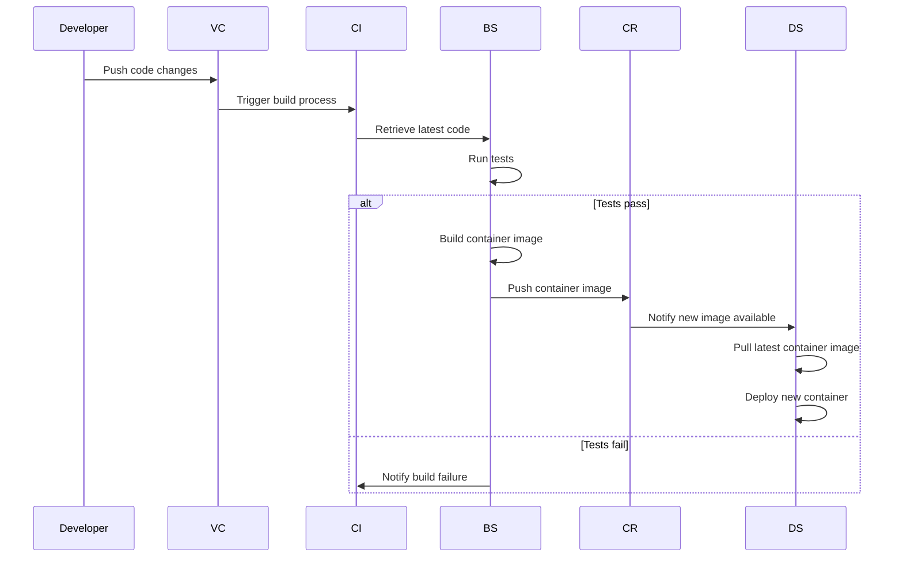

## Summary

## Introduction

:::alert{type="note"}
This is part of my **DevOps** learning journey! If anything seems off, feel free to leave a [comment](#comments) or connect with me on :mention[Linkedin (LucJosin)]{url="https://www.linkedin.com/in/LucJosin"} or :mention[GitHub (LucJosin)]{url="https://github.com/LucJosin"}.
:::

While studying **DevOps** and containerized applications, one of the first things that we learn is: _How to do a deployment pipeline to get your containers/images **built**, **tagged**, and **pushed** automatically_.

In this post, I’ll walk through how I set up a **CI/CD** workflow using **GitHub Actions** to publish containers/images to **GitHub Container Registry (GHCR)**.

### What is CI/CD?

The **CI/CD** stands for `Continuous Integration` and `Continuous Deployment` _(or Delivery)_.

- **CI**: Automates the process of testing and building code every time you push changes.
- **CD**: Automates deployment, getting your code into an enviroment _(e.g: production/devlop)_.

By using both, you ensure every change is **integrated**, **tested**, **built**, and **shipped** quickly.

### What is GHCR (GitHub Container Registry)?

The **GHCR** is GitHub’s native container registry, similar to :mention[Docker Hub]{url="https://hub.docker.com"}, but more integrated with **GitHub**. It allows you to:

1. Store and manage containers/images
2. Associate images directly with repositories
3. Control access via GitHub permissions

It’s free for public repositories and supports private image hosting too. Plus, it works perfect with **GitHub Actions**.

### Visual workflow

Here's a visual workflow for the **CI/CD**:



## Application overview

For this post, I built a simple **Golang** webapp. You can find the code in the GitHub repository:

https://github.com/LucJosin/labs/tree/main/blog/actions-containers-ghcr

## Setting up the Dockerfile

Before setting up our **GitHub Actions** workflow, let's define the **Dockerfile**, which describes how to _build_ and _run_ our **Go** application inside a **container**.

Here's the complete **Dockerfile**:

```dockerfile
# ---- Build Stage ----
FROM golang:1.22-alpine AS builder

# Set working directory
WORKDIR /app

# Install necessary packages
RUN apk add --no-cache git

# Copy go mod file
COPY go.mod ./

# Download dependencies
RUN go mod download

# Copy the rest of the source code
COPY . .

# Build the Go app
RUN GOOS=linux go build -o app main.go

# ---- Run Stage ----
FROM alpine:latest

# Set working directory
WORKDIR /app

# Copy the binary and template files from the builder stage
COPY --from=builder /app/app /app/index.tmpl ./

# Expose port
EXPOSE 8080

# Run the application
CMD ["./app"]
```

In this case, we used a multi-stage **Dockerfile**:

1. **Build**:

   - Sets up the **Go** environment using a image _(with Golang configured)_.
   - Installs necessary packages _(like **Git**, used for **Go** fetching dependencies)_.
   - Copies the source code and modules files.
   - Downloads dependencies with `go mod download`.
   - Builds the application into a binary using `go build`.

2. **Run**:

   - Uses a **lightweight** (base) image to keep the final image small.
   - Copies the compiled binary from the **build stage**.
   - Sets the **working directory**.
   - Exposes the **port** the app will use.
   - Defines the **command** to run the app.

## Setting up the GitHub Actions

Now that we have defined the instructions/steps to build the image, let's configure our **build.yml** workflow, this file tells **GitHub Actions** _how_ and _when_ to execute automated _actions/steps/tasks_.

GitHub let's you have multiple `workflow` files, all **.yaml** configuration have to be in `.github/workflows/` directory.

Here’s the complete workflow file:

```yaml title=".github/workflows/build.yml"
# Workflow name shown in the GitHub Actions
name: 'Build and Push to GHCR'

# Trigger the workflow when pushing a tag like: v1.0.0
on:
  push:
    tags:
      - 'v[0-9].[0-9]+.[0-9]'

# Set environment variables available to all steps
env:
  GHCR_TOKEN: ${{ secrets.GHCR_TOKEN }} # GitHub Container Registry token (set in repository secrets)
  CONTAINER_NAME: lucjosin/go-webapp-ghcr # Image name to publish (all lowercase)
  USER_NAME: LucJosin # GitHub username used for GHCR authentication

jobs:
  build-and-push:
    runs-on: ubuntu-latest # Use the latest Ubuntu runner

    steps:
      # Step 1
      - name: Set up checkout
        uses: actions/checkout@v4

      # Step 2
      - name: Set up latest git tag
        run: |
          RAW_TAG="${GITHUB_REF#refs/tags/}"
          VERSION="${RAW_TAG#*@}"
          echo "VERSION=${VERSION}" >> $GITHUB_ENV
          echo "Version: $VERSION"

      # --- Build Stage ---

      # Step 3
      - name: Docker build
        run: |
          docker build -t ghcr.io/${{ env.CONTAINER_NAME }}:latest .
          docker build -t ghcr.io/${{ env.CONTAINER_NAME }}:${{ env.VERSION }} .

      # --- Push Stage ---

      # Step 4
      - name: GitHub (GHCR) login
        run: echo $GHCR_TOKEN | docker login ghcr.io -u $USER_NAME --password-stdin

      # Step 5
      - name: GitHub (GHCR) push
        run: |
          docker push ghcr.io/${{ env.CONTAINER_NAME }}:latest
          docker push ghcr.io/${{ env.CONTAINER_NAME }}:${{ env.VERSION }}
```

The workflow contains the following steps:

1. **Set up checkout**: Setup the configure repository code **(so that the workflow can access it)**.
2. **Set up latest git tag**: Extracts the version from the latest **Git** tag.
3. **Docker build**: Builds the image, tag with versions: **latest** and **env.VERSION** _(defined earlier)_.
4. **GitHub (GHCR) login**: Logs into **GHCR**.
5. **GitHub (GHCR) push**: Pushes the images to **GHCR**.

:::alert{type="warning"}
The `CONTAINER_NAME` variable MUST be in **lowercase**.
:::

After publishing a new release version _(like v1.0.0)_:

- Your image will appear in the **Packages** section of your repository.
- You can pull it on any host by using the **full image path**.

### Preparing the Environment

We need to prepare the repository environment before the workflow run, it involves: **Updating workflow permissions** and **Creating a GHCR token**:

#### Updating workflow permissions

This workflow require additional permissions to run :highlight[successfully]{bg="green" color="#ededed"}. This ensures that your workflows have the necessary access to **read**, **write**, and accessing **secrets**, follow the steps in the GIF below to update them:


You can find these settings in your repository's `Settings > Actions > General section`

#### Creating a GHCR token

You can go to [github.com/settings/tokens/new?scopes=write\:packages](https://github.com/settings/tokens/new?scopes=write:packages) to create a new token, the `?scopes=write:packages` param will correctly select the **write\:packages** scope that will be use to **download and upload container images**.

:::alert{type="note"}
Note that, according to the docs:

1. **GitHub Packages only supports authentication using a personal access token (classic).**
2. **By default, when you select the write\:packages scope for your personal access token (classic) in the user interface, the repo scope will also be selected.**

See more at [docs.github.com](https://docs.github.com/en/packages/working-with-a-github-packages-registry/working-with-the-container-registry#authenticating-with-a-personal-access-token-classic)
:::

If you don't know to **add a secret in a GitHub Repository**, open the box below:

<details>
<summary>How to add a secret in a GitHub Repository</summary>

1. Go to the repository on GitHub.
2. Click on the **"Settings"** tab of the repository.
3. In the left sidebar, navigate to **"Secrets and variables" > "Actions"**.
4. Click the **"New repository secret"** button.
5. Fill in the fields:

   - **Name**: the name of the secret (e.g., `GHCR_TOKEN`)
   - **Secret**: the value of the secret (e.g., your personal access token)

6. Click **"Add secret"** to save.

</details>

## Triggering the workflow

Once the **GitHub Actions** workflow is defined, you can trigger it by `pushing a new tag` that follows the version pattern defined in the workflow:

```bash
git tag v1.0.0
git push origin v1.0.0
```

After the tag is pushed, **GitHub Actions** will automatically run the **CI/CD** pipeline, building and publishing the app.


If everything runs successfully, you'll see the release listed under both the **Releases** and **Packages** sections.


## Using the image

Now that we have pushed the container image to the **GHCR**, we can use the following methods to pull and run the application locally:

### CLI

The first method to pull and run the image is using the terminal with **Docker CLI**:

```bash "docker run -d" "--name golang-app" "-p 8080:8080" "ghcr.io/lucjosin/go-webapp-ghcr"
docker run -d --name golang-app -p 8080:8080 ghcr.io/lucjosin/go-webapp-ghcr
```

Step by step:

1. **docker run -d**: Pull and start and starts a new container in `detached mode`.
2. **--name golang-app**: Define the name `golang-app` to the container.
3. **-p 8080\:8080**: Opens port `8080` **of the container** to port `8080` **on your host machine**.
4. **ghcr.io/lucjosin/go-webapp-ghcr**: This is the image being pulled and run **(Remember to use your image)**.


### Compose

The second method to pull and run the image is using the **compose.yaml** file:

```yaml "ghcr.io/lucjosin/go-webapp-ghcr" "golang-app" "8080:8080"
services:
  app:
    image: ghcr.io/lucjosin/go-webapp-ghcr
    container_name: golang-app
    ports:
      - '8080:8080'
```

Run the following command in `the same directory as the file`:

```bash
docker compose up -d
```

:::alert{type="note"}

1. Whether you use the first or second method, the container will be up and running at `http://localhost:8080`.
2. Remember to change the `ghcr.io/lucjosin/go-webapp-ghcr` to use your image path.

:::

## Conclusion

Configuring **GitHub Actions** and deploying to **GHCR** is a great introduction to **CI/CD** in the **DevOps** world. It reduces manual work and enables the creation of more complete automation workflows.

I hope this gives you a clear starting point for automating your own deployments.

## Resources and References

- [docs.github.com/working-with-the-container-registry](https://docs.github.com/en/packages/working-with-a-github-packages-registry/working-with-the-container-registry)
- [docs.github.com/about-workflows](https://docs.github.com/en/actions/writing-workflows/about-workflows)
- [docs.docker.com/multi-stage](https://docs.docker.com/build/building/multi-stage/)
